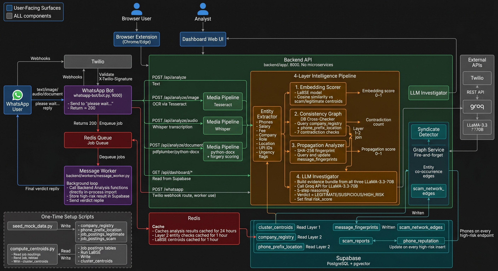
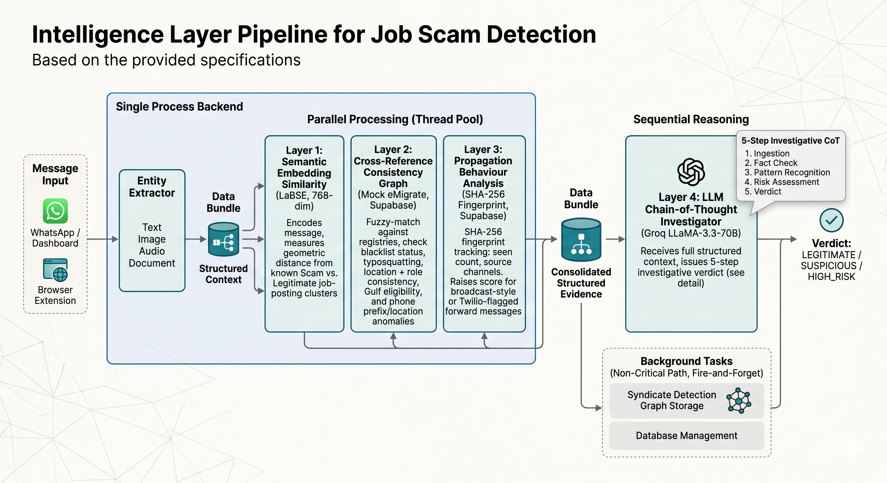
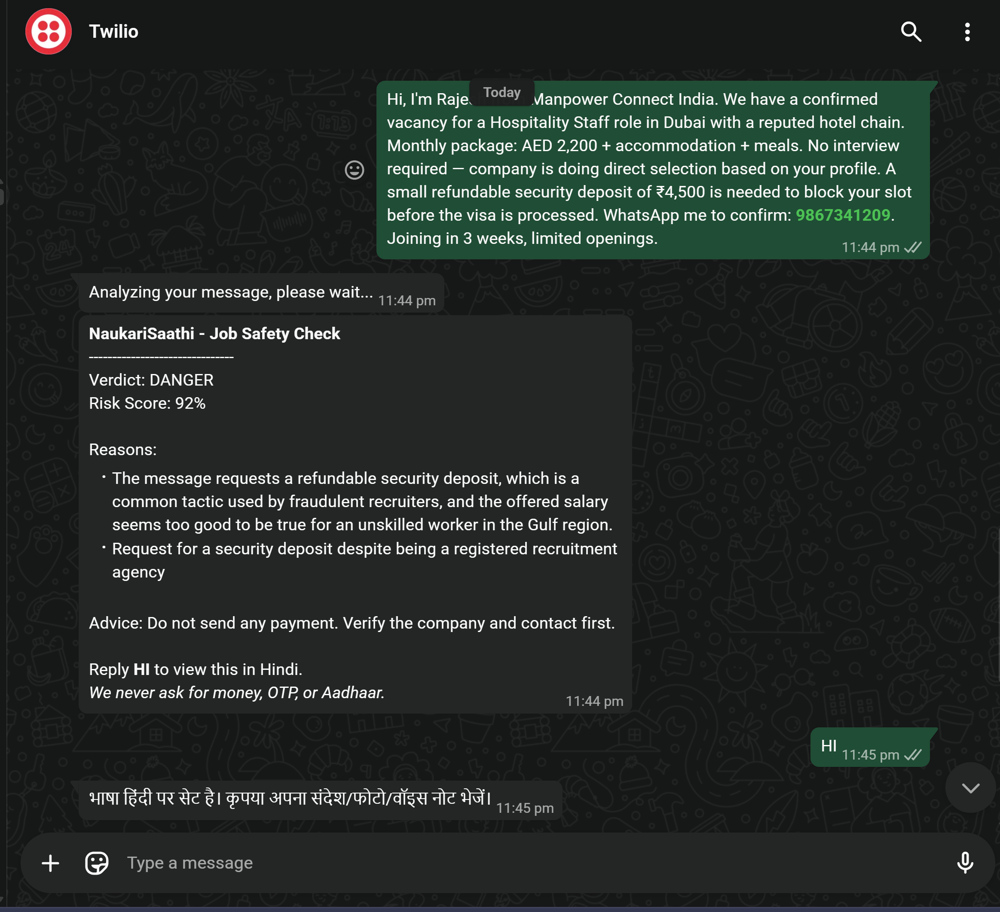
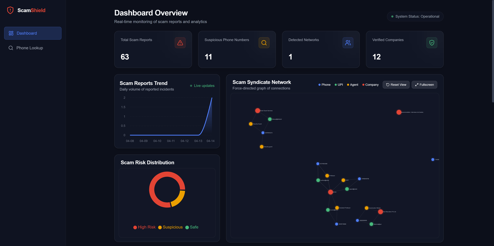
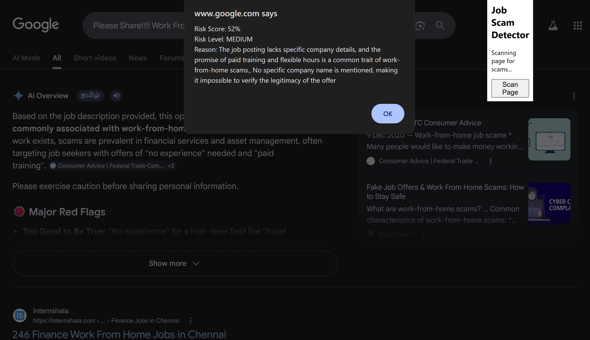

# 🛡️ ScamShield

> **AI-powered labour fraud detection protecting Indian migrant workers**

ScamShield is an end-to-end intelligence platform that detects fraudulent job recruitment messages targeting India's migrant workforce — in real time, over WhatsApp, the browser, and a live dashboard. It runs a **4-layer AI pipeline** entirely in-process, with no dependency on external government APIs.

---



---

## Table of Contents

- [The Problem](#the-problem)
- [Architecture](#architecture)
  - [4-Layer Intelligence Pipeline](#4-layer-intelligence-pipeline)
  - [System Components](#system-components)
- [Features](#features)
- [Tech Stack](#tech-stack)
- [Directory Structure](#directory-structure)
- [Getting Started](#getting-started)
  - [Prerequisites](#prerequisites)
  - [Environment Variables](#environment-variables)
  - [Database Setup](#database-setup)
  - [Running the Backend](#running-the-backend)
  - [Running the WhatsApp Bot](#running-the-whatsapp-bot)
- [API Reference](#api-reference)
- [License](#license)
- [Contact](#contact)

---

## The Problem

Every year, hundreds of thousands of Indian workers fall victim to fraudulent overseas job advertisements. Scammers impersonate legitimate eMigrate-registered recruitment agencies, advertise impossibly high Gulf salaries, and demand upfront "visa fees" — leaving families in crushing debt.

**ScamShield** gives a semi-literate migrant worker the same analytical power as a trained fraud investigator — in their language, on their phone, in seconds.

---

## Architecture

### 4-Layer Intelligence Pipeline

Every message — text, image, audio, or document — passes through a four-stage reasoning chain before a verdict is issued.



| Layer | Name | What It Does |
|-------|------|-------------|
| **Layer 1** | Semantic Embedding Similarity | Encodes the message with LaBSE (768-dim) and measures geometric distance from known scam and legitimate job-posting clusters |
| **Layer 2** | Cross-Reference Consistency Graph | Fuzzy-matches the claimed company against a mock eMigrate registry; checks blacklist status, typosquatting, location + role consistency, Gulf placement eligibility, and phone prefix vs. work location |
| **Layer 3** | Propagation Behaviour Analysis | SHA-256-fingerprints each message; tracks seen count and source channels in Supabase; raises score for broadcast-style or Twilio-flagged forwarded messages |
| **Layer 4** | LLM Chain-of-Thought Investigator | A specially prompted Groq/LLaMA-3.3-70B investigator receives the full structured evidence bundle from Layers 1–3 and issues a five-step investigative verdict |

Layers 1, 2, and 3 run **in parallel** (thread pool). Layer 4 runs after, with their results as structured context. Graph storage and syndicate detection run as a **fire-and-forget** background task — not on the critical path.

---

### System Components

```
ScamShield/
├── backend/              FastAPI app + intelligence pipeline (single backend process)
├── whatsapp-bot/         Twilio WhatsApp webhook + message dispatcher
├── dashboard/            Web dashboard (HTML/CSS/JS)
├── browser-extension/    Chrome/Edge extension for inline scam checks
├── scripts/              One-time setup scripts (seed data, centroid computation)
└── docs/                 API reference, setup guide, project status
```

---

## Features

- 🔍 **4-Layer Intelligence** — Semantic embedding + consistency graph + propagation + LLM reasoning
- 📱 **WhatsApp Integration** — Workers send a suspicious job message via WhatsApp, get a verdict in seconds
- 🌐 **Browser Extension** — Inline scam detection on job portals and websites
- 📊 **Live Dashboard** — Real-time scam report feed, risk statistics, and syndicate network graph
- 🗣️ **Bilingual Responses** — Full Hindi and English support; auto-detects language from Devanagari or Romanized Hindi
- 🖼️ **Multi-modal Analysis** — OCR on images (Tesseract), transcription for audio (Whisper), extraction from PDFs and DOCX
- 🧠 **No External Govt. APIs** — Cross-reference data comes from a Supabase mock eMigrate registry (realistic, seeded)
- 🛡️ **Propagation Tracking** — Identifies mass-forwarded scam broadcasts via SHA-256 fingerprinting
- 🕸️ **Syndicate Detection** — Graph edges between co-occurring phones/UPIs/agents identify coordinated fraud networks

---

## Tech Stack

| Layer | Technology |
|-------|-----------|
| **Backend framework** | FastAPI (Python) |
| **Intelligence models** | LaBSE (`sentence-transformers`), LLaMA-3.3-70B via Groq, OpenAI Whisper |
| **OCR** | Tesseract via `pytesseract`, OpenCV |
| **Document parsing** | `pdfplumber`, `PyPDF2`, `python-docx`, `pdf2image` |
| **Database** | Supabase (PostgreSQL + pgvector) |
| **Cache / Queue** | Redis (Upstash) |
| **WhatsApp** | Twilio Programmable Messaging |
| **Task workers** | Redis queue with async workers |
| **Rate limiting** | `slowapi` |
| **Graph storage** | Supabase `scam_network_edges` table |

---

## Directory Structure

```
backend/
├── app/
│   ├── main.py                           Entry point (LaBSE warm-up on startup)
│   ├── routes/
│   │   ├── analyze.py                    POST /api/analyze (text/image/audio/document)
│   │   ├── scam_routes.py                Scam report CRUD
│   │   └── webhook_routes.py             POST /whatsapp (Twilio webhook)
│   └── services/
│       ├── intelligence/
│       │   ├── pipeline.py               Main pipeline orchestrator ← START HERE
│       │   ├── ai_bridge.py              Thin dispatch layer (text/image/audio/doc)
│       │   ├── entity_extractor.py       Regex entity extraction (phones, UPIs, fees…)
│       │   ├── embedding_scorer.py       Layer 1: LaBSE cosine similarity
│       │   └── llm_investigator.py       Layer 4: Groq investigator prompt + JSON parser
│       ├── graph/
│       │   ├── consistency_checker.py    Layer 2: graph + DB consistency wrapper
│       │   ├── db_cross_checker.py       Layer 2: Supabase eMigrate registry checks
│       │   ├── graph_service.py          Entity graph storage
│       │   └── syndicate_detector.py     Fraud network detection
│       ├── propagation/
│       │   └── propagation_analyzer.py   Layer 3: fingerprint tracking + scoring
│       └── media/
│           ├── image_pipeline.py         OCR (Tesseract + OpenCV)
│           ├── audio_pipeline.py         Whisper transcription
│           ├── doc_pipeline.py           PDF/DOCX extraction + forgery scoring
│           └── whisper_transcriber.py    Whisper model wrapper (lazy-loaded)
├── sql/
│   └── intelligence_layer_tables.sql     New schema DDL (pgvector + registry tables)
└── workers/
    └── message_worker.py                 WhatsApp async job consumer

scripts/
├── seed_mock_data.py                     Seed company_registry + phone_prefix_location
└── compute_centroids.py                  Build LaBSE cluster centroids from seed data
```

---

## Getting Started

### Prerequisites

| Tool | Version | Purpose |
|------|---------|---------|
| Python | ≥ 3.11 | Backend |
| Tesseract OCR | ≥ 5.x | Image text extraction |
| Redis | Any (Upstash recommended) | Queue + cache |
| Supabase project | With pgvector enabled | Database |
| Groq API key | Free tier available | LLM reasoning (Layer 4) |
| Twilio account | (Optional) | WhatsApp webhook |

---

### Environment Variables

Create `.env` in the repo root (and optionally in `whatsapp-bot/`):

```env
# Supabase
SUPABASE_URL=https://<your-project>.supabase.co
SUPABASE_KEY=<anon or service role key>

# Redis
REDIS_URL=redis://localhost:6379
# or Upstash TLS: rediss://default:<password>@<host>:6379

# Groq (Layer 4 LLM)
GROQ_API_KEY=gsk_...

# Twilio (optional — WhatsApp bot)
TWILIO_ACCOUNT_SID=AC...
TWILIO_AUTH_TOKEN=...
TWILIO_WHATSAPP_NUMBER=whatsapp:+14155238886

# Tesseract (Windows only — default path used if unset)
# TESSERACT_CMD=C:\Program Files\Tesseract-OCR\tesseract.exe
```

---

### Database Setup

**Step 1 — Enable pgvector in Supabase**

Supabase Dashboard → Database → Extensions → search `vector` → Enable.

**Step 2 — Run the schema SQL**

In the Supabase SQL editor, run:

```sql
-- Contents of: backend/sql/intelligence_layer_tables.sql
```

This creates:
- `job_postings_legitimate`, `job_postings_scam`, `cluster_centroids` (Layer 1)
- `company_registry`, `phone_prefix_location` (Layer 2)
- `message_fingerprints` (Layer 3)

**Step 3 — Seed mock reference data**

```bash
# From the repo root:
python scripts/seed_mock_data.py
```

Seeds ~50 company registry rows and ~45 phone prefix rows.

**Step 4 — Compute LaBSE cluster centroids**

> ⚠️ First run downloads the LaBSE model (~500 MB). Takes ~5 min.

```bash
python scripts/compute_centroids.py
```

Embeds all seed job postings and writes two centroid vectors (`legitimate`, `scam`) to Supabase. This needs to run only once.

---

### Running the Backend

```bash
cd backend
pip install -r requirements.txt
uvicorn app.main:app --reload --port 8000
```

The backend is the **only process** needed. There is no separate `ai-services` process.

On startup, LaBSE is warm-loaded in the background (non-blocking).

**Verify it works:**

```bash
curl -X POST http://localhost:8000/api/analyze \
  -H "Content-Type: application/json" \
  -d '{"text": "URGENT — Dubai Security Guard — Rs.80,000/month — Fee Rs.8,000 — Apply today!"}'
```

Expected response: `risk_level: "HIGH"`, all four `layer_scores` populated.

---

### Running the WhatsApp Bot

```bash
cd whatsapp-bot
pip install -r requirements.txt
uvicorn bot:app --port 9000
```

Expose port 9000 via ngrok or Cloudflare Tunnel and set the webhook URL in your Twilio console to `https://<your-tunnel>/whatsapp`.

**Message format workers** (separate terminal):
```bash
cd backend
python workers/message_worker.py
```



---

## API Reference

| Method | Endpoint | Description |
|--------|----------|-------------|
| `POST` | `/api/analyze` | Analyze a text message |
| `POST` | `/api/analyze/image` | Analyze an image (multipart) |
| `POST` | `/api/analyze/audio` | Analyze an audio file (multipart) |
| `POST` | `/api/analyze/document` | Analyze a PDF/DOCX (multipart) |
| `GET` | `/api/dashboard/stats` | Dashboard statistics |
| `GET` | `/api/scam-reports` | Paginated scam report feed |
| `POST` | `/api/scam-reports` | Submit a manual scam report |
| `GET` | `/health` | Backend health check |
| `GET` | `/health/redis` | Redis connectivity check |
| `POST` | `/whatsapp` | Twilio WhatsApp webhook |

**Sample analysis response:**

```json
{
  "risk_score": 0.92,
  "risk_level": "HIGH",
  "is_scam": true,
  "verdict": "HIGH_RISK",
  "confidence": 94,
  "key_contradiction": "An eMigrate-registered agency cannot legally charge any recruitment fee — this request is a statutory violation.",
  "hindi_worker_message": "Yeh offer bilkul fraud hai — koi bhi paisa mat bhejiye.",
  "reasons": [
    "Fee of ₹8,000 requested — illegal under eMigrate Act for registered agencies.",
    "Company 'Global Career Solutions' is blacklisted in the registry.",
    "Claimed location Dubai does not match registered city Kolkata."
  ],
  "layer_scores": {
    "embedding": 0.83,
    "consistency_contradictions": 4,
    "propagation": 0.65,
    "llm_confidence": 94
  },
  "entities": {
    "phones": ["9876543210"],
    "salary": 80000,
    "fee": 8000,
    "role": "Security Guard",
    "location": "Dubai",
    "company": "Global Career Solutions",
    "upi_ids": [],
    "urgency_flags": ["urgent", "apply today"],
    "has_fee": true,
    "has_urgency": true
  }
}
```

---





---

## License

This project is licensed under the MIT License - see the [LICENSE](LICENSE) file for details.

---

## Contact

For any queries or support, please contact [sudhan4843@gmail.com](mailto:sudhan4843@gmail.com)

---

> *"Every year, lakhs of Indian workers fall prey to fake Gulf job offers. ScamShield gives them a trained investigator in their pocket — for free, in their language, on their phone."*
